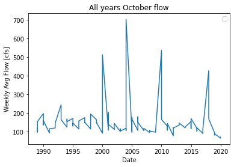

# Abigail Kahler
# Week 8 Forecast Summary
\
**1.A brief summary of the AR model you built and why. Use whatever graphs you find helpful:**

This week I built an autoregressive model based on flow values from January 2017 through January 2019. This date range gave a coefficient of determination value of .67 which was much higher than when I explored other date ranges or additional time steps. I also plotted October values for the entire date range to look at patterns and further inform my 16 week forecast guestimate.  

**2.An explanation of how you generated your forecasts and why (i.e. did you use your AR model or not?)**\
The individual forecast values of my AR model were unrepresentative from the beginning, so I did not use it for either my short term or long term forecasts. I used my function to gauge the percent decreases from one year to the next and chose a similar value to adjust the model predictions. For my sixteen week forecast, I changed this "decrease_by" value each month. The sixteen week forecast still does not represent typical seasonal pattern and still involves guesswork, but the guessing is now more documented and structured within the code.\
I consistently defined variables for the 16 week code and avoided typing single values so that it can be reformed into a loop.\
\
**3.A brief summary of what you got out of the peer evaluation. How did you make your script better?**\
The peer evaluation was a good opportunity to check in with a classmate and compare ideas. Seeing what they were doing differently, or additionally, encouraged me to keep trying to do more. Most of my time is spent experimenting and applying concepts that either don't work or don't work for the intended purpose, so they get deleted. This week I focused on simple structures that can be refined after proving functional. My script is not elegant yet but it is more representative of what I am trying to accomplish.\
\
**Describe the part of your script that you are most proud of and why.**\
\
I am encouraged that I have solidified a structure for the 16 week forecast and can visualize next few steps for to get it to where I want it to be.
