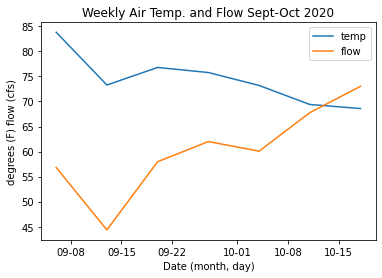

# Abigail Kahler
# Week 9 Homework

___
## Grade
3/3 - Nice work, sorry office hours were busy this morning and I didn't get to talk with you. Can you come back on  Thursday? 
__

**1. A brief summary of the how you chose to generate your forecast this week.**\
\
I used my updated framework from last week to generate the new forecast, since I have not incorporated the new dataset into it yet.\
\
**2. A description of the dataset you added
What is the dataset?\
Why did you choose it?\
What location have you chosen?\
Where did you get the data from?\
What was your approach to accessing it?**\
\
My new dataset is temperature. I used Mesonet to access data for\
Yavapai county, and was looking for precipitation but kept the search\
broad to return anything matching my date and location requests and\
this is what it returned. The initial data is by hour and it generated\
errors until I narrowed the search to be only the past two years.\
I started with Daymet but was unsure how to apply the commands.\
Mesonet’s interface was more intuitive for me. Now that I have\
navigated Mesonet, I think I can go back to Daymet and get the data\
I was looking for.

**3. A plot of your additional time series along with your streamflow time series.**\
\
\
\

