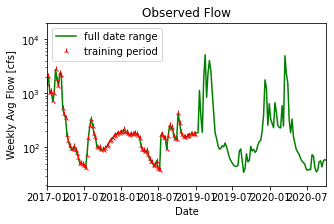
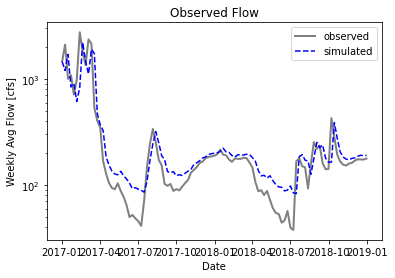

**Abigail Kahler**\
**Homework Week 6**\
\
\
**1. What you are using as your prediction variables**\
The prediction variables are date ranges for training, chosen by coefficient of determination values, and flow.\
\
**2. The final equation for your model:**\
y = .78x + 53.38\
\
**3. What you used as your testing and training periods:**\
Training: 01/01/2017 through 01/01/2019\
Testing: 01/01/2019 through 10/03/2020\
\
**Summary**\
I modified the existing code to generate an autoregressive model that considers recent streamflow to inform short-term predictions. I chose date ranges that gave an R^2 value of .67, which aligned with the training and testing periods being nearly equal.\
\

However, the prediction plot with these ranges showed a simulation that closely matched the shape of observed flow but was staggered, and notably cut across annual flow minimums.\
\

This could be improved by a lengthier training period so the simulation would better recognize the annual lows. This was a pitfall of using one value (R^2) to manipulate the fit. I think including more years and additional time steps would give a more realistic fit, even if the coefficient of determination was lower. The forward near-fit of the rest of the data is interesting. It could be "pulled" back by exploring timesteps and extending the training period forward, which might also have effect on the large mismatch at 2017 and 2018.\
Using the general *y=mx+b* equation from my plot gave wild predictions, so I weighed this with the simulated flow being ahead of observed and made a guess from that.This week I would like to refine the whole process and increase accuracy of individual predictions.  
